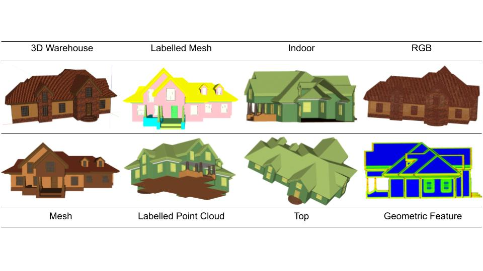
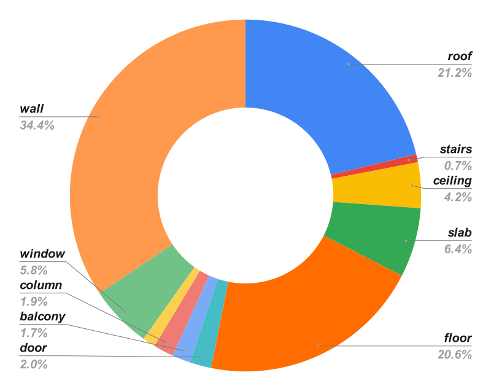

# BIO Dataset: 3D Indoor–Outdoor Building Semantic Segmentation Benchmark

## Introduction

To perform effectively, machine learning (ML) and deep learning (DL) algorithms require high-quality training samples and accurate and detailed annotations. We describe a semi-automatic framework for creating a dataset and establish a canonical benchmark dataset, the 3D building indoor outdoor dataset (BIO dataset), which is a highly accurate, high level of detail, and high coverage dataset for 3D building point cloud and mesh semantic segmentation. According to statistics, the total area of this dataset is 481,769 square metres, with an average of 75,587 triangular faces per building, and it contains 11 building structure semantic categories.

This dataset enables the training and evaluation of **deep learning** and **machine learning** models for built-environment understanding in applications such as:
- Indoor navigation
- Digital twins
- Facility management (BIM/GIS integration)
- Urban modelling and simulation
- Energy efficiency and structural analysis

> If you use this dataset, please cite the paper (see below).
> 
----
## Some examples of our dataset

----

## Statistics of BIO dataset

